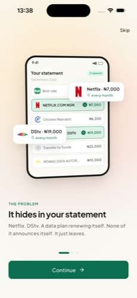
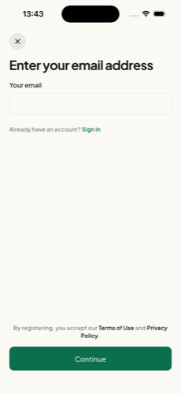
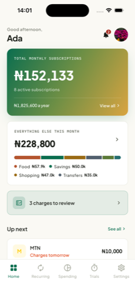
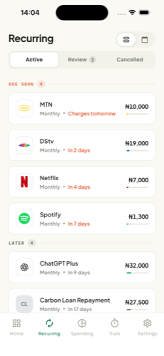
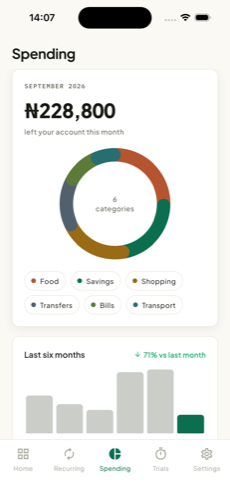
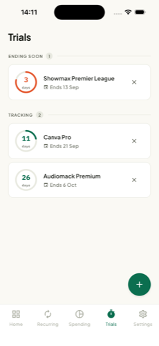

# Recur, product requirements

**Company:** Damprose Innovations Limited
**Product:** Recur, iOS and Android
**Prepared for:** Mono compliance review
**Date:** 11 September 2026
**Website:** https://recur.website

---

## 1. What Recur is

Recur is a personal finance app. It reads a user's bank transactions, read-only,
and works out which debits repeat: subscriptions, data plans, a streaming trial
that quietly converted, a plan whose price went up without notice. It then tells
the user what is due next and warns them before it leaves the account.

Recur never holds, moves or transmits funds. It has no payment capability of any
kind, and no code path that could move money.

## 2. The problem

Money leaves Nigerian accounts quietly. A data plan renews itself. A trial ends
and becomes a charge. A subscription price rises and nobody sends a letter about
it. The information is all there in the bank statement, but nobody reads a
statement line by line, and the bank's alert arrives after the money has gone.

## 3. How Mono fits in

| Step | What happens |
| --- | --- |
| 1 | The user taps to connect a bank inside Recur |
| 2 | Mono's hosted Connect flow opens. **The user authenticates with their bank inside Mono's screen.** Recur never sees, receives or stores the credentials |
| 3 | Mono confirms the link to Recur by **webhook**. Recur does not treat an account as linked on the client's word alone |
| 4 | Recur reads the account's transaction history through Mono's API, read-only |
| 5 | The detection engine groups debits by merchant and narration, clusters them by amount, and classifies the gap between them into weekly through yearly bands |
| 6 | Detected subscriptions appear in the app, with what is coming next and when |
| 7 | The user can unlink at any time, which stops all further reading |

**Mono products used:** Connect, for account linking, and the transaction and
account endpoints, for reading history.

**Mono products not used:** DirectPay, Direct Debit, Lookup, or any other
product that moves money or initiates a payment.

## 4. What the app looks like

**Home** shows the monthly total across detected subscriptions, the annual
figure behind it, anything due soon, and charges awaiting the user's review.
**Recurring** lists every detected subscription with its amount and next charge
date, in a list or a calendar. **Spending** breaks the month down by category
against the previous six. **Trials** tracks a free trial before it becomes a
charge, since a trial has no transaction behind it for Recur to detect.

## 5. What data we request, and why each field is needed

| From Mono | Used for |
| --- | --- |
| Account institution and masked account number | Showing the user which account is connected. The full number is never stored |
| Transaction date | Working out how often a charge repeats, and projecting the next one |
| Transaction amount | Grouping charges into amount clusters, and detecting a price change |
| Transaction narration and payee | Identifying the merchant behind a charge |
| Transaction type, debit or credit | Only debits are candidates for a recurring charge |
| Transaction category | Seeding the spending breakdown, which the user can correct |

Nothing is requested that is not used by a feature above.

## 6. What we do with it

**Detection.** Debits are grouped by merchant and narration, clustered by
amount, and the gap between them is classified into a cadence. Amount clusters
are chained over time, so a price rise updates the subscription the user already
has instead of creating a second one.

**Trials.** For merchants known to run trials, a single debit is enough to flag
a possible trial, rather than waiting for a second charge that would cost the
user money.

**Reminders.** With the user's consent, an email before a charge lands, and a
weekly digest. Each channel has its own switch and its own unsubscribe link,
signed with an HMAC token.

## 7. What we never do

- We never see, receive or store bank credentials
- We cannot move money. No transfer, payment or withdrawal is possible
- We do not sell, rent or share data for advertising
- There is no third-party analytics, advertising or tracking SDK in the app
- We never store a full account number

## 8. Data handling

| | |
| --- | --- |
| **Storage** | PostgreSQL on Supabase. Provider secrets encrypted at rest with AES-256-GCM |
| **In transit** | HTTPS throughout, including every call to Mono |
| **Passwords and one-time codes** | argon2id, one-way, never recoverable |
| **Sessions** | 15-minute access tokens against 30-day refresh tokens, stored hashed and individually revocable |
| **New-device alerts** | A sign-in from an unrecognised device emails the account holder |
| **Retention** | For the life of the account |
| **Deletion** | Deleting the account re-asks for the password, unlinks the account at Mono, then removes the user and everything under it: linked banks, transactions, detected subscriptions, charge history, budgets, sessions |
| **Withdrawing consent** | Unlinking a bank stops all further reading immediately |

A full record of processing, the sub-processor list and the technical measures
are documented separately and available on request.

## 9. Compliance position

| | |
| --- | --- |
| **Company** | Damprose Innovations Limited, registered with the CAC |
| **Category** | Information and Communication. Recur is a software company, not a financial institution |
| **Licence** | None held, and none required. Mono is the CBN-licensed party for the data access |
| **Privacy notice** | Published at https://recur.website/privacy |
| **NDPR certification** | In progress through a licensed DPCO |
| **Stage** | Pre-launch. No member of the public holds an account yet |

## 10. Contact

Oluwagbemiga Shoga, Damprose Innovations Limited
support@recur.website
